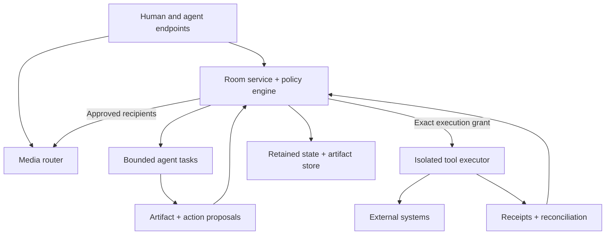

# Commonline Architecture

Status: **Working architecture proposal**

Commonline separates live media, durable coordination state, agent work, and external effects.



## Major components

### Client
Owns local media, interface state, consent choices, and the participant's acknowledged room version.

### Media router
Routes approved streams to approved recipients. Media permission is enforced before delivery. Agent failure must not break human-to-human audio.

**P0-c implementation note:** the first media path is direct one-to-one WebRTC between human browsers. The room service relays offer/answer/ICE/hangup signaling only after checking live room membership plus `SPEAK` / `RECEIVE_MEDIA` grants. Signaling is ephemeral: it does not increment the room version, enter the durable event log, or appear in resume deltas. The silent agent has no live-media grant in this rung.

### Room service and policy engine
Authoritative owner of room membership, state versions, grants, work state, accepted outcomes, and retention policy.

### Agent task coordinator
Dispatches bounded work using explicit context references, deadlines, leases, and budgets. Agents receive no ambient authority merely by entering a room.

### Artifact and memory service
Stores accepted outcomes, provenance, version history, and retention conditions. Raw speech is not required for room continuity.

### Isolated executor
Holds tool credentials and performs deterministic authorization immediately before any external effect.

### Receipt service
Distinguishes accepted, dispatched, completed, failed, and outcome-unknown states. Dispatch is never silently promoted to completion.

## Core boundary

```text
conversation
    ↓
proposal
    ↓
policy evaluation
    ↓
proper authorization
    ↓
executor re-check
    ↓
dispatch
    ↓
observed result
    ↓
receipt / reconciliation
```

A conversational utterance such as "that sounds good" is not an execution grant.

## Identity model

Humans, agents, organizations, devices, and services remain distinct entity types. A display name or network address is not proof of identity or authority.

## Media model

Microphones, agent speech, music, sound effects, and playback objects should remain identifiable sources. This enables per-source routing, local gain, ducking, accessibility equivalents, and prevention of synthetic-audio feedback loops.

The current P0-c path deliberately keeps microphone frames out of the room service. A future SFU/media-router rung can add group routing, but it must preserve the same recipient and persistence separation.

## Persistence model

The durable room state should favor reviewed outcomes:

- accepted artifacts
- unresolved questions
- named decisions and dissent
- active commitments
- grants and expiry
- provenance and evidence
- work status

A transcript is optional evidence, not authoritative memory.

## Dormancy

An empty room becomes dormant by default. Background work may continue only under an active, bounded lease and budget.


## P0-d identity and session boundary

P0-d freezes a participant as a logical room principal and a session as an ephemeral attachment:

```text
Participant
  └── Session
        └── Connection
```

The server coalesces reconnects by participant id. A replacement connection supersedes the older transport without manufacturing a second person or a durable leave/join pair.

Participant identity is still locally generated and unauthenticated in P0-d.

## P0-d backstage / stage boundary

Agent work is split into three surfaces:

```text
PRIVATE SCRATCH
    ↓
ROOM PROPOSAL
    ↓
DURABLE ACCEPTANCE
```

Scratch is application-level temporary material, never model chain-of-thought. It lives in a separate ephemeral work plane and is never serialized into room snapshots, durable events, resume deltas, or acceptance receipts.

A content-free status plane may expose `working`, `waiting`, `blocked`, `completed`, or `failed` without exposing scratch content.

## Acceptance model

P0-d acceptance is:

- tied to one work-item id
- tied to one artifact id
- tied to one exact `ACCEPT_OUTCOME` grant receipt
- keyed by a client-stable idempotency id
- single-writer per work item

A repeated request with the same accept id returns the original receipt. A competing acceptance for the same work item is rejected with the canonical receipt.

Supersede/retract is intentionally not implemented yet.


## P0-e durable store

The authoritative room service now has a local SQLite adapter.

Durable transitions use disk-first semantics:

```text
derive next state
    ↓
BEGIN IMMEDIATE
    ↓
verify persisted previous version
    ↓
write snapshot + append event
    ↓
COMMIT
    ↓
mutate in-memory cache
    ↓
broadcast
```

If SQLite fails, the in-memory authoritative room is not advanced.

The database persists identity and governed outcomes but deliberately does not persist runtime presence state. Humans recover offline after restart and must establish a new live session.

Scratch, status pulses, sessions, signaling, and media stay outside the store.


## P0-f identity plane

The transport now has an identity gate before room admission:

```text
WebSocket
   ↓
identity challenge
   ↓
signature verification
   ↓
authenticated participant/session binding
   ↓
room join
```

Identity claims live beside room storage but do not grant room capability.

The private key remains browser-side. The server stores only the public key and a recovery-code hash.

### Authority handoff

`ACCEPT_OUTCOME` can be transferred atomically from one human participant to another.

The room transition writes a grant revocation receipt, replacement grant, authority-transfer receipt, role projection, and event in the same durable SQLite transaction.

The immutable receipt chain, not the role string, is the authority history.


## P0-g internet media plane

The room service now provides authenticated ephemeral ICE configuration after a participant has proved identity and joined the room.

```text
authenticated participant
      ↓
rtc_config_request
      ↓
STUN / TURN configuration
      ↓
RTCPeerConnection
      ↓
selected direct or relay path
```

TURN credential material is transport configuration, not room authority or room history.

Coturn REST-style credentials can be minted from a server-only shared secret and expire automatically. The browser refreshes the configuration before expiry.

### Failure boundary

WebRTC failure must clean up media resources without mutating durable undertaking state.

Call setup, disconnected-peer grace, unanswered ringing, microphone loss, and failed ICE/peer states are handled in the browser media plane. Durable room state remains available even if the call dies.

### Diagnostics boundary

Candidate types and WebRTC stats are local observational telemetry. P0-g does not add them to SQLite, room events, or resumption deltas.


## P0-h ephemeral media-session layer

One-to-one WebRTC negotiation now sits behind an explicit server-arbitrated media session:

```text
Room participant A
       ↓
rtc_call_open
       ↓
MediaSessionRegistry
       ↓
callId + generation
       ↓
WebRTC negotiation
       ↓
STUN / TURN selected path
```

Media sessions are deliberately not durable room entities.

The registry coalesces simultaneous call opens for the same pair, prevents a participant from occupying two calls, rejects stale generations, and ends the exact active call when a participant leaves.

### Perfect-negotiation boundary

Each side receives a deterministic polite/impolite role. SDP glare is resolved in the browser using the standard perfect-negotiation pattern while every signal remains bound to the server-issued call id and generation.

This allows negotiation state to be disposable while room identity, authority, work, and accepted outcomes remain durable.


## P0-i multiparty media control boundary

P0-i introduces an ephemeral group-media control plane:

```text
Room human participants
        ↓
GroupMediaSession
        ↓
identified microphone sources
        ↓
directed subscriptions
        ↓
mesh-p0 pair transports
```

The current executable adapter is a three-human WebRTC mesh. This proves the source/subscription semantics without introducing an SFU runtime dependency.

The server remains authoritative for group membership, publish permission, subscription permission, session generation, and whether a participant pair may exchange signaling.

### SFU seam

The intended future SFU consumes Commonline's existing control objects rather than replacing them:

- authenticated participant id
- group media session id + generation
- source id + owner
- subscriber id + source id
- room-scoped SPEAK / RECEIVE_MEDIA grants

An SFU may route packets. It does not become a Commonline participant or authority source.

### Mesh limitation

Because P0-i media packets remain peer-to-peer SRTP, the server cannot enforce source-level packet routing against a malicious client after signaling has been authorized.

The supported client obeys the routing plan. P0-j must move enforcement into an SFU if the client is not trusted.

## P0-j real SFU adapter

The P0-i source/subscription model now drives a mediasoup packet router. Commonline remains authoritative for whether the SFU may create a Producer or Consumer.

One mediasoup Worker and WebRtcServer are shared by the process. Each active group-media generation receives its own Router. Participant transports and packet-routing objects are ephemeral and are closed when the Commonline control state no longer authorizes them.

An SFU transport existing does not create a Commonline grant, source, subscription, or durable room event.

## P0-k source-policy plane

P0-k adds a policy object between a participant's generic SPEAK authority and a concrete mediasoup Producer.

```text
Room grant plane
      ↓
MediaSourcePolicy
      ↓
GroupMediaSource
      ↓
mediasoup Producer
      ↓
explicit subscriptions
      ↓
mediasoup Consumers
```

The policy catalog is ephemeral runtime configuration, not durable room truth. Source policies constrain which principal kinds may instantiate a source class and whether that source class is executable in the current rung.

P0-k deliberately keeps future music, agent voice, and system-tone classes reserved instead of smuggling them into the human microphone path.


## P0-l acceptance-observation plane

P0-l adds browser-local Consumer statistics as observational test evidence. The stats surface reads mediasoup-client Consumer RTP counters and track state; it does not mutate Commonline group state, room versions, grants, or durable storage.

The acceptance harness therefore sits outside the authority chain:

```text
Commonline authority → media routing → Consumer stats observer
```

The observer can fail without gaining permission to create or alter a route.


## P0-m agent voice authority plane

Agent voice authority is durable room state upstream of any renderer:

```text
ACCEPT_OUTCOME (one-time compatibility bootstrap)
        ↓
MANAGE_AGENT_VOICE
        ↓
AgentVoiceGrantReceipt
        ↓
future local TTS renderer
        ↓
agent-voice source
        ↓
SFU + explicit subscriptions
```

The bootstrap bridge is intentionally one-time. It does not make ACCEPT_OUTCOME a general media-delegation capability.

Renderer state and synthesized audio remain outside durable storage. A renderer may consume authority but cannot create it.


## P0-n local renderer and direct RTP path

P0-n adds a capability plane downstream of durable P0-m authority:

```text
AgentVoiceGrantReceipt
        ↓
AgentVoiceRuntime
        ↓
LocalVoiceRenderer
        ↓
PCM16
        ↓
PCMU RTP
        ↓
mediasoup DirectTransport
        ↓
agent-voice Producer
        ↓
explicit human subscriptions
```

The default renderer is disabled. Piper is an optional local CLI adapter backed by a caller-provided local model. CI uses an explicit deterministic tone renderer to exercise the same PCM-to-RTP path without downloading a model.

The mediasoup Router supports Opus for browser microphone/audio producers and PCMU for server-local agent audio. Agent voice does not require the agent to masquerade as a human WebRTC participant.

Renderer status and utterance progress are ephemeral. Voice authority remains durable and upstream.


## P0-o attention plane

P0-o adds a memory-only attention registry between durable voice authority and conversational agent turns.

```text
durable AgentVoiceGrantReceipt
        +
ephemeral AttentionLease
        ↓
one directed agent turn
        ↓
existing local renderer
        ↓
existing agent-voice source
        ↓
existing explicit subscriptions
```

The attention registry is not part of SQLite, room versions, or durable event history. A human leaving live group media or losing the current session removes that human's leases.

Lease consumption occurs inside the voice runtime after room, voice-grant, renderer, prompt, group-media, and busy-state checks. This prevents an internal caller from bypassing the attention boundary while still avoiding unnecessary lease consumption for obviously invalid requests.

P0-o keeps prompts and generated turn text out of the status plane and out of durable room state.


## P0-p bounded listening plane

P0-p introduces a separate selected-context path rather than extending the SFU audience graph:

```text
explicit human capture
      ↓
ListeningShareLease
      ↓
16 kHz PCM16
      ↓
LocalSpeechRecognizer
      ↓
ephemeral transcript
      ↓
agent READ_SELECTED_CONTEXT
```

The target agent never becomes a subscriber to the human microphone source.

Listening leases, audio, transcripts, recognizer buffers, and listening status remain outside SQLite and room-version history. Content-free status may be observed by the room while transcript content is returned only to the sharing human.


## P0-q explicit conversation exchange gate

P0-q inserts a private, memory-only exchange registry between bounded listening and agent speech:

```text
ListeningShareRuntime
      ↓
private transcript
      ↓
ConversationExchangeRegistry
      ↓
HEARD state
      │
      └── no speech
             ↓
separate AttentionLease
      +
AgentVoiceGrantReceipt
      ↓
AgentVoiceRuntime
      ↓
one exchange-bound spoken reply
```

The registry stores transcript text only in private process memory for the exchange lifetime. Public exchange views contain identifiers and state but never transcript content.

A failed reply releases the exchange claim but does not restore the consumed attention lease.


## P0-s pre-membership history boundary

The durable room snapshot and durable event replay are treated as distinct surfaces.

On first membership, a participant receives the current authoritative room state but no event delta from before that identity joined. On later reconnects, the room service derives an immutable history floor from the earliest durable `participant_joined` event for that identity and clamps client acknowledgement to that floor.

A client cannot obtain older events by claiming `acknowledgedVersion = 0`.

If durable membership provenance is missing, the server fails closed and withholds older event replay rather than guessing.

Retrospective history sharing is not implemented in P0-s.


## P0-u external-effect firewall

P0-u adds an isolated execution boundary downstream of durable artifact acceptance.

```text
accepted Artifact
      +
current RoomSnapshot version
      +
exact active EXECUTE_EXTERNAL_EFFECT grant
      ↓
ExternalEffectRuntime
      ↓
LocalProofEffectExecutor
```

The local proof executor is deliberately non-effectful outside process memory. It exists to prove that the authorization check occurs immediately before execution.

P0 does not issue `EXECUTE_EXTERNAL_EFFECT` grants. Therefore accepted artifacts remain inert by default.

The effect request is ephemeral and does not mutate room state. No effect receipt is persisted in P0-u because the production path cannot become authorized yet.


## P0-v context delegation firewall

P0-v adds a separate authority boundary for onward context sharing:

```text
accepted artifact
      +
current room version
      +
exact active DELEGATE_CONTEXT grant
      ↓
ContextDelegationRuntime
      ↓
LocalDelegationProofExecutor
```

The proof executor is process-local and does not contact another principal or external service.

Room membership, `READ_ROOM_STATE`, `SUBMIT_WORK`, `ACCEPT_OUTCOME`, speaking authority, and execution authority do not imply `DELEGATE_CONTEXT`.

P0 issues no delegation grants, so the normal runtime path fails closed with `NOT_AUTHORIZED`.


## P0-w pilot worker capability plane

P0-w makes the silent-worker implementation selectable without changing Commonline authority semantics:

```text
SUBMIT_WORK grant
      ↓
bounded WorkItem.prompt
      ↓
SilentAgent provider seam
      ├── mock
      └── ollama-local
              ↓
       one proposed Artifact
              ↓
       existing ACCEPT_OUTCOME boundary
```

The local inference provider receives only the explicit work prompt. It is not passed room state, transcripts, resume history, grants, media state, or tools.

The Ollama adapter accepts loopback endpoints only and refuses redirects. Provider failure produces a failed work status and no proposal.

Worker configuration is ephemeral service capability, not durable room truth. The server exposes a non-secret worker profile through its public health surface, and the browser displays that profile to participants so the processing boundary is visible before a pilot session.

P0-w does not change the Commonline wire or SQLite layout.
