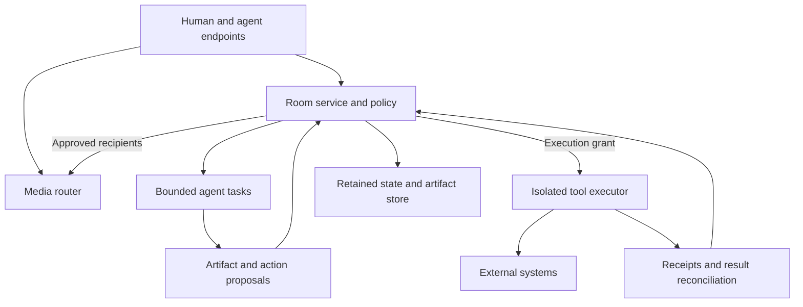

# Commonline: A Governed Conversation Runtime

**Exploratory design study — v0.1 Draft**

## 1. Document control

| Field | Value |
|---|---|
| Document ID | COMMONLINE-DESIGN |
| Prior version | None — new baseline |
| Current version | v0.1 Draft |
| Version | v0.1 |
| Status | Draft; proposals have not been accepted for implementation |
| Artifact type | Exploratory product blueprint and conceptual system architecture |
| Date | 2026-09-29, America/Los_Angeles |
| Prepared for | Mikey Hughes |
| Prepared by | Codex, through the current design session |
| Supersedes | None — new baseline |
| Source artifact | User-supplied `Pasted text.txt`; local copy `upload/01-Pasted-text.txt`; source hash recorded in the detached execution log |
| Source basis | Current user brief; retrieved primary technical standards and official documentation; original design synthesis |
| Checker receipt reference | Sections 30–31 and `Commonline_Design_Study_v0.1_Checker_Execution_Log.md` |
| Final artifact hash | Final whole-file SHA-256 is recorded in the detached execution log to avoid self-reference |

The user's brief controls this study. No controlling implementation specification, prototype, approved roadmap, or executed product experiment was supplied. Existing named projects are potential integration targets, not inspected or established integrations.

## 2. Status and classification legend

**Epistemic class:** Fact = supported by an identified source; Assumption = provisional basis for proceeding; Hypothesis = testable prediction; Engineering proposal = proposed design; Symbolic interpretation = a metaphor rather than an implemented or physical mechanism.

**Maturity:** Normative = controlling within this document; Candidate = proposed for acceptance; Exploratory = retained for investigation; Deferred = intentionally postponed.

The inherited principle **CAPABILITY ≠ AUTHORITY** and the requirement for explicit, visible, consent-aware participation are Normative. Unless stated otherwise, architecture and product choices below are Engineering proposal / Candidate. Benefits and emergent social behavior are Hypothesis / Exploratory. “Feasible now” means the constituent mechanisms have an available technical basis; it does not mean this system has been built or validated.

## 3. Executive summary

The deepest useful abstraction is a **shared undertaking**: a bounded, addressable effort with participants, unresolved questions, artifacts, obligations, permissions, and an end condition. Live calling is one way its participants interact. A room holds its continuity; a live episode temporarily gathers attention around it.

The proposed product makes discussion and permitted background work concurrent. It preserves selected, approved outcomes rather than treating a transcript as authoritative memory. It separates joining, hearing, speaking, learning history, contacting others, and executing actions. Agents can request human involvement at a dependency they cannot resolve, without acquiring the person's authority.

The initial experiment should use two humans, one silent agent, one persistent room, and one artifact task. The product hypothesis is that concurrent work plus reliable resumption reduces reconstruction and produces better usable output. That hypothesis remains untested. Public federation, ordinary telephone bridges, continuous autonomous operation, and multiple specialized agents are later possibilities.

## 4. Problem and context

The brief describes a desire for more expressive calling and for useful work to happen during conversation. Its premise that telephone communication is stale is a motivating judgment, not a measured finding. The existence of voice, bots, documents, and persistent rooms does not itself establish a new category or a defensible invention.

The opportunity worth testing is more specific: can a group carry an undertaking across live conversation, independent work, absence, and resumption without losing intent, exposing private speech, or confusing discussion with permission? A meeting with an assistant and shared document is an important conceptual baseline. Commonline must improve on that experience rather than win through feature count.

## 5. Intended users and stakeholders

| Stakeholder | Intended value | Decision rights and burdens |
|---|---|---|
| Small creative or engineering team | Make and inspect work while talking; resume without reconstruction | Own acceptance of work and permission over their contributions |
| Family or friendship group | Expressive presence and selected shared continuity | Need private moments, low friction, and a useful agent-free mode |
| Agent operator | Offer bounded skills and receive task offers | Own operational budgets, credentials, updates, and incident response |
| Room steward | Maintain membership, conduct, and continuity | Cannot grant authority over another person's data or resources |
| Invited outside specialist | Answer a narrowly scoped question | Needs an accurate disclosure of context and a refusal path |
| Non-participant or incidental bystander | Avoid unintended capture, attribution, or exposure | Must be considered in capture policy; a room badge cannot resolve every bystander issue |
| Maintainer and host operator | Run a reliable service | Responsible for documented processing boundaries and recovery |

No institutional adoption, demand, named collaborator commitment, or legal authority is established.

## 6. The underlying concept and terminology

Use four objects:

1. **Undertaking:** the purpose, open dependencies, resources, and finish condition.
2. **Room:** the durable namespace, membership policies, retained state, and history permissions.
3. **Episode:** a temporary interval of live participation with its own audience, processing consent, and media keys.
4. **Work item:** a bounded request or obligation that can outlive an episode under an explicit grant.

A casual conversation may have an undertaking as simple as “spend time together.” Task extraction is optional. The system must not reinterpret social interaction as a productivity pipeline.

The operational state can be expressed conceptually as:

`room = purpose + membership + grants + open questions + proposed work + accepted artifacts + commitments + retention policy`

This is a data-model proposal, not a formal proof or minimum sufficient representation. A recording is optional evidence, outside the room's essential definition.

Presence should be multidimensional. “Connected,” “receiving audio,” “available to answer,” “working on a task,” and “authorized to act” are separate states. A person can be connected but unavailable. An agent can be working without receiving speech. An agent can be technically available but prohibited from answering a particular request.

## 7. Discoveries beyond the initial feature list

### 7.1 A call becomes a temporary allocation of scarce attention

Most agent work does not require synchronous speech. Use asynchronous requests by default; open a live exchange when participants need rapid clarification, negotiation, demonstration, or an authority decision. “Call an agent” therefore means asking it to enter a bounded interaction with a purpose, context offer, resource budget, and exit condition.

This yields an **attention lease**: limited permission to occupy the shared audio channel. A task grant does not include a speaking grant. An agent requests the floor; a deterministic room policy or authorized person grants it; the lease expires after its time or turn budget. Human speech and human cancellation take priority. Private cues, result cards, and batching are first-class delivery choices.

The protocol must coordinate permission to interrupt, not merely permission to connect. The hypothesis is that this matters more to usability than adding more agent roles.

### 7.2 Persistence without recording

Preserve selected decisions, approved tasks, accepted artifacts, and unresolved disagreements. Let raw speech, tentative interpretations, and unapproved drafts expire under a visible policy. A person can explicitly pin a moment or approve a note while speaking.

Live machine listening remains processing even if nothing is saved. If listening or transcription has not been consented to, the agent cannot silently derive notes from that speech. An ephemeral transcript does not become harmless simply because it is transient.

The room's durable state should show who proposed a statement, who endorsed it, who disputed it, what evidence supports it, and when it needs reconsideration. “A participant suggested option A” must not become “The group chose A.”

### 7.3 Context is leased, and absence does not imply endorsement

An invited expert receives the minimum context needed for a question, under a disclosure policy with audience, purpose, expiry, and onward-sharing limits. Joining a room grants no automatic access to its older history. A room may reveal its task offer before offering a private context package.

A returning person receives a change digest from their last acknowledged room version: changed artifacts, new evidence, disputed decisions, expired grants, and remaining questions. The digest is filtered by current authorization and never exposes an intervening private channel.

An agent can explain an absent person's recorded constraints with provenance. It cannot claim to be that person, invent a fresh opinion for them, or consent on their behalf.

### 7.4 Work branches; consent and authority do not merge automatically

A builder can develop option A while a challenger examines option B. Both use an identified snapshot. Their artifacts return as proposals tied to that snapshot. If humans change the requirements meanwhile, the results are stale until reconciled.

Merging work requires an acceptance decision. Accepting an artifact into room state does not authorize deployment, messaging, purchases, or device changes. Publication and execution are separate transitions.

This makes exploration inexpensive without letting several agents convert a brainstorm into a chain of external effects.

### 7.5 The room can become an organizational memory of reasons

Store why an option was chosen, what was rejected, what evidence would reverse the decision, and who owns the next question. Each retained decision may include a **valid-until condition** such as “revisit when the interface changes.” A project can then notice that its earlier conclusion no longer fits the present.

This creates a possible maintenance runtime: bounded work wakes on approved events rather than continuously generating chatter. An expired grant pauses it. This is more useful than an always-on room that consumes inference merely to appear alive.

### 7.6 Public rooms could publish contested knowledge

A public research party line could emit a maintained claim collection: supporting sources, counterarguments, uncertainty, corrections, and explicitly responsible maintainers. Its value would depend on editorial process and evidence, not on agent agreement.

Keep participation identity and publication identity separate. A person might contribute under a stable pseudonym while the publication records the responsible steward. Avoid a universal “trust score”; credentials, delivery history, and source quality describe different properties and can all be gamed.

### 7.7 Rooms can bridge organizations without copying everything

Two project rooms might negotiate through a small shared boundary room. Each retains its private history. They exchange approved offers, constraints, questions, artifacts, and receipts. Neither room inherits the other's tools or policies.

This could turn certain handoffs into interactive contracts with live exception handling. The needed evidence concerns useful handoffs, selective disclosure, responsibility, and recovery across independently operated services. It is a hard integration problem, not established interoperability.

### 7.8 Sound can refer to work rather than merely decorate it

Propose **audible objects**: a sound cue linked to an artifact, task, location, or explicitly pinned moment. A quiet spatial cue says “the comparison is ready”; selecting its visual counterpart opens the comparison. A short tonal motif can identify a room or signal an unresolved dependency. Each cue has a visual/caption equivalent and can be disabled.

For social rooms, local mix controls let participants choose music intensity and reaction volume. For working rooms, speech remains clear and incidental effects are rate-limited. The producer role is a separate grant. Do not infer emotion or willingness from tone to trigger autonomous actions.

## 8. FEASIBLE NOW, HARD BUT PLAUSIBLE, SPECULATIVE

| Class | Proposed capability | Basis or missing evidence |
|---|---|---|
| FEASIBLE NOW | Web voice, separate media sources, silent background agent, draft artifact cards, room resumption | Available communication and storage mechanisms; integration and usability still require testing [S1, S2] |
| FEASIBLE NOW | Structured agent task offers, deferred replies, result artifacts, explicit grants | Standard task transport can be adapted; governance is application work [S3] |
| FEASIBLE NOW | Local gain, panning, sound cues, playback objects | Audio processing building blocks exist; interaction effectiveness is untested [S2] |
| FEASIBLE NOW | Bounded history access and approved durable outcomes | Ordinary access-control and persistence design; sensitive derivatives need review |
| HARD BUT PLAUSIBLE | Low interruption across many humans and agents | Requires validated scheduling, human controls, overload behavior, and accessible interfaces |
| HARD BUT PLAUSIBLE | Federated rooms and agents with revocation, responsibility, and budgets | Trust policy, credential custody, cross-host recovery, and abuse handling are unresolved |
| HARD BUT PLAUSIBLE | Private media plus selected machine processing | Need explicit cryptographic recipients and tested clients; a model service is a disclosure boundary [S4, S5, S6] |
| HARD BUT PLAUSIBLE | Useful ordinary telephone participation | Requires a gateway, explicit media-processing notices, reduced controls, and telecom review [S7] |
| SPECULATIVE | Large communities coordinating principally through maintained undertakings | Social legitimacy, participation burden, and governance have not been demonstrated |
| SPECULATIVE | A durable personal agent presence that improves relationships | Benefits, dependence, impersonation risk, and acceptable boundaries remain unknown |
| SPECULATIVE | Reliable autonomous agreement across unrelated organizations | Identity and receipts do not establish shared values, truthful claims, or legal agency |

The classification does not claim originality or patentability. Several mechanisms may overlap with existing communication and collaboration products. The experiment must demonstrate the proposed combination's value.

## 9. Goals and success criteria

| ID | Goal | Proposed observable criterion | Maturity |
|---|---|---|---|
| G-01 | Concurrent useful work | A bounded artifact becomes inspectable while humans continue the discussion | Candidate |
| G-02 | Continuity across absence | Participants identify current decisions and next work without re-explaining the prior episode | Candidate |
| G-03 | Explicit authority | An ungranted external action is blocked at the executor and visibly reported | Normative |
| G-04 | Attention protection | Participants can keep the agent silent, inspect results later, and stop it immediately | Candidate |
| G-05 | Selective persistence | Only authorized retained outcomes survive the agreed expiry boundary | Normative |

No goal is reported achieved.

## 10. Non-goals

The initial experiment excludes public agent discovery, automatic outbound calling, arbitrary device control, emergency-service substitution, paid transactions, federation, carrier-call overlays, video, licensed commercial music catalogs, and simulation of absent people. These exclusions are proposed scope choices. Revisit them only after the narrower value test and relevant boundaries have evidence.

## 11. Operating principles and inherited canon

| ID | Principle | Consequence |
|---|---|---|
| PR-01 | CAPABILITY ≠ AUTHORITY | Tool availability, advertised skill, and model confidence cannot issue a grant |
| PR-02 | Visible consent-aware participation | Silent agents and processing destinations appear in the roster and processing controls |
| PR-03 | Proposal precedes material action | Discussing an action does not execute it; a proposal is bound to a specific effect |
| PR-04 | Human authority at its proper boundary | A room host cannot approve another person's data disclosure or external resource change |
| PR-05 | Attention is scarce | Silent results are the default; speaking and contacting require separate policy |
| PR-06 | Selective continuity | Retention has an audience, purpose, expiry, and deletion behavior |

PR-01 through PR-04 preserve the supplied brief's authority and consent boundaries. PR-05 and PR-06 are proposed elaborations. No unrelated project canon is inherited.

## 12. Scope and system boundary

Inside: room state, episode participation, media routing policies, agent task routing, outcome proposals, authorization decisions, artifact references, and execution receipts. Outside: external systems' actual permissions, telecom infrastructure, identity issuers' assurance, model-service retention policies, and participants' independent recording devices.

Each boundary must remain explicit: client-to-host; host-to-agent operator; agent-to-model service; executor-to-tool; room-to-room; gateway-to-telephone network. An invitation does not bridge these boundaries automatically.

The web client is the initial target. Desktop and mobile clients later share the same control protocol. Native mobile clients would need platform calling, audio, notification, and background-lifecycle integration; their exact implementation and supported behavior are Not yet established.

## 13. Claim-boundary register

| Claim | Epistemic class | Maturity | Support and permitted strength |
|---|---|---|---|
| Browser media and data transport have a standardized basis | Fact | Normative | WebRTC specification [S1]; no assurance about this design's implementation |
| Agent task discovery and artifact exchange have a protocol basis | Fact | Normative | A2A specification [S3]; no inference of authorized action |
| Attention leasing improves agent participation | Hypothesis | Exploratory | Original synthesis; compare with a silent-card baseline |
| Shared undertakings improve resumption | Hypothesis | Exploratory | Original synthesis; measure reconstruction and corrections |
| Room state can survive without saved raw speech | Engineering proposal | Candidate | Specific data and retention design below; requires verified processing behavior |
| A living room is a small institution | Symbolic interpretation | Exploratory | A useful organizational metaphor, not legal personhood |
| External action requires proper authority | Engineering proposal | Normative | User's controlling requirement; execution needs independent enforcement |
| Product demand and operating cost are acceptable | Assumption | Candidate | Needed for a viable product; presently unknown; pilot must measure both |

## 14. Requirements

| ID | Requirement | Verification |
|---|---|---|
| FR-01 | Distinguish principal identity, attendance, processing access, history access, and authority | Inspect rosters, grants, and negative access cases |
| FR-02 | An agent with task permission but no speaking permission produces a silent result card | Run a task with speaking disabled |
| FR-03 | Every retained decision remains attributable and distinguishable from suggestions and dissent | Inspect a deliberately disputed decision |
| FR-04 | Publication of an artifact and execution of an external action use independent authorization checks | Accept an artifact, then attempt an ungranted effect |
| FR-05 | Resume from an acknowledged state version using currently authorized information | Join after a private branch and inspect the digest |
| FR-06 | Enforce recipient and purpose limits before context leaves a room | Attempt unauthorized agent delegation |
| FR-07 | Revocation prevents new dispatches and stops future media delivery to the revoked receiver | Revoke during active processing; inspect timing and in-flight effects |
| FR-08 | Empty rooms suspend by default; surviving work requires a bounded active grant | Leave while a task has expired or active permission |
| NFR-01 | Human audio continues when an agent task fails | Disconnect the agent worker |
| NFR-02 | Policy operations use authoritative versions and deterministic enforcement | Submit a stale or duplicated command |
| NFR-03 | Mobile or network loss degrades visibly without implying completion | Disconnect and reconcile task state |
| NFR-04 | Sensitive content and its derivatives follow documented retention policies | Inspect expiry, source withdrawal, and derivative lineage |
| NFR-05 | Cue and task status have accessible non-audio equivalents | Exercise visual, keyboard, and caption paths |

FR-01, FR-04, FR-06, and FR-07 are Normative boundaries. Other rows are Candidate implementation requirements. Performance thresholds will be registered before a pilot; no measured latency or capacity is supplied here.

## 15. System architecture

Conceptual architecture: keep media timing, coordination state, and external effects in separate paths.



WebRTC provides the media/data foundation [S1]. Use an SFU, a server that forwards selected streams, as the proposed group-media shape. Keep each human microphone, agent voice, and playback object identifiable. Clients control their mixes. A gateway or explicitly trusted mixer may mix media when endpoints cannot; disclose any decrypting participant. Network traversal and relay operation are dependencies rather than assumptions that every client has a direct path.

Use a reliable event connection to an authoritative room service for membership, grants, tasks, artifact proposals, and receipts. Order those events per room and deduplicate by event ID. Collaborative free-text notes may use conflict-tolerant editing; grants, decisions, and external-effect approvals require authoritative validation. Do not place latency-sensitive audio frames into the durable event log.

Agents run as separate workers with limited context, task budgets, and no ambient access to tool credentials. A tool executor holds appropriate credentials and re-evaluates policy at execution time. It receives an immutable effect proposal, an exact grant, and current state. It records acceptance, dispatch, remote result, and reconciliation separately.

## 16. Components and responsibilities

| Component | Inputs and state owned | Outputs and failure behavior |
|---|---|---|
| Client | Local media, interface state, consent selections, acknowledged room version | Media and commands; shows disconnected or stale state |
| Room service and policy engine | Room version, membership, data policies, grants, work graph | Admitted events and recipient policies; denies stale or ungranted actions |
| Media router | Approved endpoints and streams; ephemeral routing state | Selected media; loss must not invent durable outcomes |
| Agent task coordinator | Scoped context references, leases, deadlines, task state | Drafts, progress, clarification requests; pauses on budget or grant expiry |
| Artifact and memory service | Approved payloads, provenance links, retention conditions | Versioned artifacts and authorized resume digests; withdrawn sources trigger derivative review |
| Isolated executor | Effect proposal, grant, tool-specific credential | Dispatch and outcome records; uncertain effects enter reconciliation |
| Identity and directory service | Principal IDs, issuer/operator claims, public keys, endpoint advertisements | Verified bindings within stated assurance; ambiguous identity blocks sensitive admission |
| Optional telephone gateway | Authorized inbound call and room media policy | Reduced audio participation; gateway is an explicit trust boundary |

A search index or vector store may index authorized retained content as a derived service. It is not an authority source, and its results must be filtered by current permissions. SQL-like structured storage can hold grants and work state; encrypted object storage can hold artifacts. These are implementation categories, not selected vendors.

## 17. Interfaces and contracts: the proposed open protocol

The useful protocol extension concerns room semantics rather than a new media codec or a replacement for agent task transport. WebRTC carries live media; SIP is a candidate session-signaling bridge for telecom participation [S7]; A2A supplies task-oriented agent exchange; tool adapters can use a tool-access protocol where supported. Adapter support has not been built.

A2A already describes agent cards, task state, and artifacts [S3]. Add room identity, admission, selective context, attention, retention, and authority semantics around those mechanisms. A advertised skill card is descriptive; the room still evaluates identity, consent, and actual permission.

| Primitive | Preconditions and owner | Result and error behavior |
|---|---|---|
| `offer_interaction` | Sender may contact this recipient; offer excludes undisclosed private context | Purpose, requested modalities, expiry, response window, context offer, and resource limits; refusal/busy/deferred are normal |
| `admit_participant` | Receiver or room policy approves identity, audience, and processing conditions | Attendance scoped to this episode; no inherited history access |
| `grant_context` | Relevant data authority approves the recipient, purpose, and source references | Expiring context view; denied sources remain absent |
| `request_floor` / `lease_floor` | Actor may request; deterministic scheduler or authorized person controls lease | Time/turn/audience bound permission; reject, queue, expire, or yield |
| `offer_work` | Context and task execution are separately allowed | Bounded task contract and lifecycle; insufficient authority requests proper human input |
| `propose_outcome` | Work result has source/version references | Inspectable draft artifact, decision, or effect proposal |
| `accept_outcome` | Appropriate human decision right for the affected object | Publish a new state version; does not dispatch external effects |
| `authorize_effect` | Proper resource authority approves exact immutable proposal | Short-lived, recipient-bound execution grant; no permission inferred from conversation |
| `revoke_grant` | Authorized issuer or override controller | Stop new use and dispatch, update recipients; report in-flight limits |
| `resume_view` | Current authorization permits referenced retained objects | Delta from acknowledged version; stale or withdrawn information is labeled |
| `receipt` | Actual observation by an identified issuer | Distinguishes received, dispatched, completed, failed, or outcome-unknown |

Every control event needs schema version, event ID, room/episode/task scope, actor binding, causal references, policy version, server acceptance time, and integrity protection. Sensitive payloads remain in separately governed storage. Receipts contain only the reconstructable minimum. A signature supports attribution under a key binding; it does not establish that the signed claim is true.

An execution grant binds actor, issuer, tool audience, operation, exact resources, immutable payload digest, scope, expiry, limits, and delegation policy. Default delegation is disabled. Re-check it immediately before dispatch. The effective allowance is the intersection of the issuer's actual authority, resource policy, data-disclosure rules, recipient admission, and narrower delegated scope. A generic `USE_TOOL` flag is insufficient.

The names above are illustrative primitives, not a frozen schema or implemented API. A conformance suite, version negotiation rules, identity profile, and threat model are dependencies for publishing an interoperable specification.

## 18. Agent-to-agent calling, presence, and identity

An address resolves a principal and an endpoint; it is not the person's or agent's proof of identity. Bind credentials to a durable principal and a current agent instance. Show entity type, responsible operator or issuer, verification level, declared software/version, and relevant grants. Treat software claims as self-declared unless independently attested. Humans, agents, organizations, devices, and services remain visibly different entity types.

The receiving endpoint can accept a silent task, offer a deferred response, request less context, declare busy, reject the task, or negotiate a live episode. Presence reveals only a coarse availability state under an explicit visibility policy. Reputation, if introduced, is limited to scoped delivery records and reported credentials; neither grants authority.

Semantic voicemail is a stored, expiring offer with a question, permitted context, and expected result. Receiving voicemail authorizes no execution. Cancellation may arrive after an external effect has begun, so its receipt must distinguish “stopped before dispatch” from “request received; effect may already have occurred.”

Humans can join or observe an agent exchange only if that exchange's policy admits them. The owning human's access to a room does not automatically expose another party's private backchannel. Room-owned agent coordination should expose participants, work items, budgets, and outcomes to authorized operators; it need not expose model internal reasoning. Private personal channels remain independently governed.

## 19. Data flows and control flows

**Media flow:** approved sender → router → approved receiver. Voice processing, live transcription, saved audio, persistent notes, and onward context export are separate processing choices. Media permission is enforced before delivery, not by asking a model to forget audio it has already received.

**Work-data flow:** selected context view → bounded worker → proposed artifact → review → accepted version. Drafts inherit source disclosure restrictions. An excerpt or summary remains derived data; transformation alone does not free it from the original policy.

**Control flow:** explicit request → proposal → policy evaluation → proper authorization → re-evaluation at executor → dispatch → observed result → receipt/reconciliation. Non-authorized conversation cannot enter this path as an executable command.

**Resumption flow:** acknowledged room version + current authorization → permitted delta → corrections/dissent/staleness indicators. Newly admitted people see only specifically permitted history.

Room lifecycle: created, open, dormant, suspended, archived. Attendance has an independent lifecycle. Work lifecycle: offered, accepted, working, input needed, authority needed, completed, failed, canceled, expired, outcome unknown. These are proposed room states rather than asserted A2A enum mappings.

An empty room becomes dormant by default. Active background work continues only within its original lease and budget. Closing an episode does not renew that lease. Removing a data source triggers review of downstream derived content; it cannot retroactively erase copies already received by an outside party.

## 20. Governance and authority

Admission, processing consent, task assignment, outcome acceptance, and execution authority are different decisions. A host may manage conduct while lacking permission to share someone's file or change an organization's switch configuration.

Conversation statements such as “that sounds good” are candidates for confirmation, not action grants. Silence is not group agreement. A designated resource owner can approve an effect through a concrete authenticated control; acceptance records its exact scope. A retained decision may record supporters and dissenters rather than a fictional unanimous consensus.

Offer private, ephemeral, selected-outcome, and explicitly recorded modes. Each mode is a policy bundle that discloses its processing and retention behavior. A late join that changes the processing audience pauses new machine delivery until affected consent conditions are resolved. The pilot can use a simple all-participant machine-listening consent rule; more granular policies are later work.

When a worker reaches a boundary, it issues a small request: who must decide, which exact proposal needs authorization, and what happens if they decline. The agent may notify that person only through an already permitted contact path. It never appoints itself as their delegate.

## 21. Safety, security, privacy, and audio behavior

For the MVP, disclose a trusted-service processing model accurately. Do not label ordinary server-accessible media as end-to-end private. For a mature mode, SFrame is a standards basis for protecting media from the forwarding server [S4], and MLS is a candidate group key-management basis [S5]. W3C encoded transforms supply a browser mechanism for local media encryption [S6]. Integration and browser support require verification in chosen clients.

Any agent that understands live speech must be an authorized plaintext recipient somewhere. Local processing, a participant-operated worker, and a cloud model service expose different trust boundaries. Encryption does not hide content from its intended processing endpoint. Different audiences require distinct channels and keys; removing a recipient affects future delivery, not previously learned content.

Use per-source media routing to keep sound effects and agent-generated speech from becoming a self-triggering transcription loop. Known synthetic playback can be labeled as such. Client gain controls, ducking, level limits, and accessible cue equivalents are proposed behavior. A telephone mix needs mix-minus behavior so it does not return a caller's own audio to them. These interaction choices still need tests.

On Android, documented playback capture requires permissions and permits only selected audio usages and capture policies [S8]. Design this product's own VoIP path and an explicit telephone gateway; do not base the architecture on capturing or injecting audio into arbitrary existing carrier calls. Apple-specific lifecycle support is a further platform investigation, not a capability established here.

California Penal Code §632 addresses recording or eavesdropping on confidential communications without all-party consent, subject to its definitions and exceptions [S9]. Retention controls alone do not resolve that question. Proposed response: explicit machine-processing disclosure and consent, a no-machine-processing path, documented late-join behavior, and jurisdiction-specific review before real telephony deployment. This is a product boundary, not a finding of legal compliance.

Music, clips, and recordings have rights implications. U.S. copyright law identifies exclusive rights relevant to copying and performance [S10]. Initial media should be participant-owned or explicitly authorized for this use; a subscription or public URL is not treated as room redistribution permission. The relevant license and use remain separate review questions.

## 22. Failure modes and recovery

| Failure mode | Architectural response | Remaining limitation |
|---|---|---|
| Agent joins silently and hears private speech | Visible roster; recipient admission; no media delivery before processing consent | People can still independently record outside the product |
| Late arrival changes consent conditions | Pause new machine delivery; show changed audience; resume only under valid policy | Already disclosed content cannot be undisclosed |
| Summary erases dissent or misattributes a decision | Source-linked draft; named endorsements; disagreement status; corrections | Machine interpretation still needs review |
| Private data escapes through a backchannel | Minimal context grants; separate channels; block onward delegation; govern derivatives | Perfect inference-leak detection is not established |
| Prompt injection turns content into a command | Treat external content as data; isolated workers; deterministic executor grants | The model can still draft a misleading proposal |
| Spoofed agent claims to represent a person | Credential-bound principal; operator disclosure; no authority from voice/name alone | Credential compromise requires revocation and recovery |
| Several agents interrupt or contact each other recursively | Floor leases; one coordinator; task fan-out and contact limits; bounded deadlines | Scheduling quality needs human testing |
| Notification overload | Consent to contact; quiet hours; batching; per-room attention budget | Users can choose an overly noisy policy |
| Slow inference blocks human conversation | Independent media path; silent progress; deadline; cancellation | A useful result may arrive after its conversational moment |
| Music overwhelms speech or causes echo | Separate streams; local levels; ducking; source labels; telephone mix-minus | Device and network quality still vary |
| Mobile app suspends or network disappears | Reconnect and reconcile by IDs and versions; visibly degrade to audio-only or offline | Native platform lifecycle behavior requires implementation |
| Background inference runs indefinitely | Room dormancy; expiring work leases; metered hard budgets | Poorly chosen task budgets can still waste resources |
| Duplicate delivery repeats an external effect | Idempotency when supported; dispatch journal; reconcile before retry | Arbitrary external APIs do not provide exactly-once effects |
| External effect has an ambiguous outcome | Enter outcome-unknown; query target or ask operator; prohibit blind replay | Some effects remain impossible to verify automatically |
| A withdrawn source survives in a summary or index | Provenance graph; derivative quarantine/rebuild; deletion inventory | Copies outside the controlled boundary cannot be erased reliably |
| Public agent contact becomes spam | Opt-in addresses; allowlists; admission; coarse presence; rate limits | Federation abuse governance needs independent evidence |
| Public room becomes an authoritarian record | Preserve dissent; named editors; appeal/correction; bounded retention | Social governance cannot be reduced to access control |
| Agents pressure humans to delegate for convenience | Human-visible grants; easy refusal; no grant renewal through persuasion | Product incentives and defaults need review |

The design fails closed on authority and data disclosure while aiming to preserve human audio when optional agent processing fails. A stop control ends future work and media delivery within the product's boundary; it reports rather than conceals in-flight effects.

## 23. MVP and proposed validation

Build the smallest experience that demonstrates concurrency and resumption:

- Two humans join one browser room.
- One silent agent receives only explicitly consented live processing and selected room materials.
- Either human sends a bounded request through a simple task control while continuing to talk.
- The agent returns one useful artifact, such as a comparison, outline, diagram, or tiny sandboxed prototype.
- Humans inspect the card and explicitly choose what enters the room's durable state.
- Everyone leaves. The next episode presents accepted work, unsettled questions, and the next step.
- A single participant-owned sound cue tests expressive playback. Full music catalogs are outside the experiment.

One worker can perform different jobs sequentially. The MVP does not require multiple models, public agents, a speaking agent, tool-heavy automation, PSTN, or a new federation stack. Its retention promise must include the actual processing service's behavior; a local UI deleting a transcript does not establish remote deletion.

### Validation already performed

Primary-source retrieval and document review were performed for this study. No validation evidence was supplied for a working Commonline implementation. No user experiment, latency measurement, security assessment, legal compliance assessment, or cost measurement was executed. The document checker is only a static artifact check; its observed runs are recorded separately.

### Proposed validation

Proposed exploratory pilot: six pairs, two matched tasks per pair, twenty-minute episodes, counterbalanced order. Compare the prototype with an ordinary voice session plus shared notes. Resume each task on a later day. This is a small learning pilot, not a statistically conclusive trial.

Before starting, register task comparability, artifact scoring, retention settings, budget, and thresholds. Candidate advancement conditions:

| Measure | Candidate learning gate | Failure interpretation |
|---|---|---|
| Useful concurrent result | At least four of six pairs receive and use a result before their episode ends | Work integration or task fit is weak |
| Resumption | At least four pairs resume with less reconstruction than their matched baseline | Persistence may not improve on notes |
| Preference | At least four pairs choose it for another comparable task | Feature novelty did not translate into repeat value |
| Retained-state fidelity | No critical false approval; participants can identify and correct lesser mistakes | Authority or memory design needs repair |
| Attention | Participants report acceptable distraction and can operate silence/stop controls | Scheduling is harming conversation |
| Governance probes | Ungranted speaking, history access, delegation, and external effects are blocked | Do not advance to effectful operation |

These counts are proposed decision aids, not inferred population-level results. Do not combine a modest usability signal with a failed authority probe and call the system ready.

### Missing evidence

Unknown: the best initial user group; willingness to retain any speech-derived state; transcription reliability in noisy and overlapping speech; supported mobile behavior; average task cost; acceptable latency; accurate derivative deletion; interoperable trust and liability; value beyond a good shared document.

The first product question is whether users value simultaneous work and trustworthy resumption. If most benefit comes only from an ordinary end-of-call summary, narrow the product to that finding rather than escalating feature count.

## 24. Implementation phases and mature system

| Phase | Proposed scope | Entry and exit evidence |
|---|---|---|
| P0 — Experience proof | Two humans, one silent worker, selected durable outcomes, one cue | Enter with explicit processing choices; exit with pilot value and governance results |
| P1 — Bounded collaboration | More roles, attention leases, context-limited agent exchange, visible backchannel work | Evidence of controllable interruption, bounded work, correct attribution and context isolation |
| P2 — Continuity and adapters | Multiple episodes, work branches, source expiry, native clients, selected outside tools | Reconciliation, mobile recovery, stale-result handling, exact effect grants, measured operating cost |
| P3 — Telephone access | Inbound gateway with audio notices and reduced participation | Telecom/recording review, gateway threat model, demonstrated caller control and identity limits |
| P4 — Interoperability | Open room profile, independently operated agents, room federation, portable state | Two independent implementations, conformance tests, revocation and abuse recovery exercises |
| P5 — Broader ecology | Persistent salons, maintained knowledge rooms, selective organization bridges | Evidence of stewardship, sustainable economics, consent, and credible dispute handling |

All phases are Candidate; no implementation or commitment is claimed. A mature system could make rooms portable across hosting services and agents replaceable without destroying room state. It could support public and private rooms, scoped subcontracting, room-owned silent agents, alternate artifact branches, and approved sensor-triggered work. It should remain useful without an agent and should let a group close or delete a room without an agent insisting on continuity.

An emergency coordination use is Deferred. Operational reliability, human fallback, accessibility, telecom behavior, and appropriate review would need a separate specification and evidence; this study establishes no emergency-service suitability.

## 25. Ordinary telephone participation

An inbound telephone call can reach a disclosed SIP/PSTN gateway, authenticate with a limited room PIN or invite code, and enter a reduced audio view of the room. Caller ID is a routing signal, not high-assurance identity. Sensitive changes need a separate authenticated path.

The gateway can announce agents and processing, offer DTMF controls or a designated human control path, and render selected result cards as spoken summaries. It must not read private side chat to the telephone audience. A gateway that handles plaintext does not preserve the app-only encryption boundary; the interface must show this change.

No-app participation is valuable, but it will not provide the app's private mix, artifact inspection, signature controls, or equivalent history navigation. Ordinary telephone capture/injection and app-based VoIP are different implementation problems. Outbound automated telephony introduces additional legal and abuse dependencies and remains outside the first product.

## 26. Risks, trade-offs, and alternatives considered

### 26.1 Observability, dependencies and constraints

Record privacy-minimized task status, grant issue/revocation, dispatch, resource consumption, recovery, and outcome transitions. An append-oriented receipt store can retain redacted event metadata while content remains deletable under policy. Do not preserve sensitive plaintext merely to make the audit trail immutable. Content digests can reveal low-entropy secrets; minimize exposed hashes and consider protected references or keyed digests where appropriate.

External effects cannot be undone by editing the ledger. A receipt records the issuer's observation, the exact proposal/grant reference, target, and known outcome. Where the target supplies confirmation, retain a governed reference to that evidence. Reporting a dispatch as completion is prohibited.

Main dependencies: real-time hosting and relay capacity; processing services with known retention behavior; credential custody; artifact storage; client lifecycle support; appropriately scoped legal review; human maintainership. Owners and costs are Unknown unless selected later.

Use a cost model rather than unsupported price estimates:

`session cost = media transport + live processing + bounded agent work + artifact storage + optional telephony`

Agent fan-out, repeated full-history context, and continuous transcription are distinct cost multipliers. Meter each separately. Dormant rooms incur storage and any explicitly configured monitoring costs, not an unlimited autonomous conversation. A viable business model, willingness to pay, prices, and margins are Not yet established.

Alternatives considered: ordinary voice plus a shared document; a single voice assistant; a transcript-centered meeting tool; a fully autonomous public agent network; an agent-free expressive calling product. The first is the pilot baseline. Transcript-centered memory is not selected because it cannot by itself represent acceptance, dissent, and authority. The autonomous network is Deferred due to trust and scope complexity. The expressive calling branch remains a legitimate product if users care more about presence than work.

## 27. Decision ledger and open questions

| ID | Decision | Status | Rationale and revisit trigger |
|---|---|---|---|
| D-001 | Preserve CAPABILITY ≠ AUTHORITY | Accepted from user brief | Controlling principle; changes require explicit user instruction |
| D-002 | Use shared undertaking / room / episode / work item distinctions | Proposed | Separates continuity from connection; revisit if users cannot understand it |
| D-003 | Begin with one silent worker | Proposed | Isolates concurrent work and attention; revisit after pilot evidence |
| D-004 | Persist selected approved outcomes by default | Proposed | Tests continuity without automatic transcript archives; revisit based on consent and usage |
| D-005 | Keep outcome acceptance separate from execution grants | Accepted as brief-derived boundary | Avoids accidental effects; test at executor |
| D-006 | Reuse existing media and agent-task transport | Proposed | Focus protocol invention on missing semantics; revisit interoperability evidence |
| D-007 | Defer public federation, outbound telephony, and absent-person simulation | Deferred | Their risks and value need distinct experiments |

| Open question | Evidence or decision needed | Blocking stage |
|---|---|---|
| Is the initial audience creative teams, engineering pairs, families, or another group? | Pilot task fit and repeat-use evidence | Product positioning |
| Which live processing mode will participants accept? | Consent comprehension and actual processor retention behavior | P0 |
| Can a state digest retain useful nuance without rewriting consensus? | Disagreement and correction trials | P0 |
| How much attention may a room request per day? | Quiet-hours, interruption, and resumption trials | P1 |
| Who owns a cross-organization outcome and its dispute process? | Explicit governance contract | P4 |
| How should private derived content be invalidated after source withdrawal? | Provenance and deletion exercises | P2 |

Owners are Unknown pending explicit selection. No missing answer is interpreted as approval.

## 28. Names and source inventory

Working names only; availability, trademark clearance, and originality have not been checked.

| Product candidate | Emphasis | Protocol candidate |
|---|---|---|
| Commonline | Shared presence and purpose | Room Coordination Protocol |
| Porch | Casual drop-in presence | Conversation Continuity Protocol |
| Workline | Parallel work during conversation | Shared Undertaking Protocol |
| Relay Room | Handoffs and human escalation | Continuity Exchange |

Recommended working pairing: **Commonline / Room Coordination Protocol**. Keep the public interface simple: “Join,” “Ask,” “Keep this,” “Catch me up,” and “Let me decide.” Internal grants and protocol vocabulary should appear only when they help a participant make a concrete decision.

Primary sources retrieved during this session, 2026-09-30 UTC:

- **S1:** W3C, [WebRTC: Real-Time Communication in Browsers](https://www.w3.org/TR/webrtc/). Transport foundation; not evidence for this product's usefulness.
- **S2:** W3C, [Web Audio API](https://www.w3.org/TR/webaudio/). Audio processing foundation.
- **S3:** A2A project, [Protocol specification](https://a2a-protocol.org/latest/specification/). Agent-task discovery and exchange foundation; application authority remains distinct.
- **S4:** IETF, [RFC 9605: Secure Frame](https://www.rfc-editor.org/rfc/rfc9605.html). Media encryption with forwarding servers.
- **S5:** IETF, [RFC 9420: Messaging Layer Security](https://www.rfc-editor.org/rfc/rfc9420.html). Candidate group key-management foundation.
- **S6:** W3C, [WebRTC Encoded Transform](https://www.w3.org/TR/webrtc-encoded-transform/). Local encoded-media transformation foundation.
- **S7:** IETF, [RFC 3261: SIP](https://www.rfc-editor.org/rfc/rfc3261.html). Session signaling foundation; does not by itself supply a telephone-network service.
- **S8:** Android Developers, [Capture video and audio playback](https://developer.android.com/media/platform/av-capture). Playback-capture constraints.
- **S9:** California Legislature, [Penal Code §632](https://leginfo.legislature.ca.gov/faces/codes_displaySection.xhtml?lawCode=PEN&sectionNum=632.). Identified recording/eavesdropping dependency; not a full jurisdictional opinion.
- **S10:** U.S. Copyright Office, [Title 17, Chapter 1](https://www.copyright.gov/title17/92chap1.html). Identified media-rights dependency; licenses and use cases remain to be evaluated.

Failed retrievals of specific FCC and Android platform pages are not used as evidence. Apple CallKit's retrieved landing page did not establish sufficient behavior to support platform-specific claims. No provider has been recommended or selected, and no purchasing, calling, messaging, or external implementation occurred.

## 29. Version changelog, feedback disposition, and glossary

| Version | Status | Changes |
|---|---|---|
| v0.1 | Draft | New exploratory baseline; independent concept, architecture, proposed protocol, MVP, failure responses, and primary-source inventory |

Reviewer-feedback disposition: Not applicable; no external review of this study was supplied. If feedback arrives, the permitted dispositions are Adopted, Modified, Deferred, Rejected, and Clarification needed. Existing proposals remain proposals until decided.

Glossary: **SFU** = selective forwarding unit; **MCU** = multipoint control unit capable of combining media; **SIP** = Session Initiation Protocol; **PSTN** = public switched telephone network; **DTMF** = telephone keypad signaling; **E2EE** = end-to-end encryption with explicitly identified recipients; **lease** = permission bounded in time and scope; **receipt** = attributable observation of a specific transition, distinct from independent verification; **principal** = durable identity used to evaluate rights; **agent instance** = a particular runtime acting under its principal/operator; **undertaking** = the purpose and evolving work around which interaction occurs.

## 30. Final Quality-Gate Record

The following records distinguish artifact review from product validation. Manual content review was performed by Codex; it is not an independent human or specialist assessment.

| Gate | Verification method | Result | Evidence or boundary |
|---|---|---|---|
| Claim discipline | Manual content review | Reviewed | Sourced facts separated from proposed design and untested benefits |
| Canon preservation | Manual content review | Reviewed | User's capability/authority and consent boundaries retained |
| Terminology consistency | Manual content review | Reviewed | Undertaking, room, episode, work item, grant, and receipt remain distinct |
| Completeness — structure | Automated checker | PASS for recorded draft | Zero errors and zero warnings in the captured draft preflight |
| Completeness — content | Manual content review | Reviewed | Required areas addressed; unknown costs, demand, mobile behavior and interoperability remain explicit |
| Internal consistency | Manual content review | Reviewed | MVP excludes effectful telephony and federation; proposed later stages preserve grant boundaries |
| Unsupported certainty — static cues | Automated checker | PASS for recorded draft | Implemented wording checks only |
| Unsupported certainty — semantic review | Manual content review | Reviewed | No implementation, user-study, market or compliance result claimed |
| Revision integrity | Not applicable | Not applicable | New baseline; no supplied reviewer feedback |
| Version and artifact identity — static | Automated checker | Recorded in detached log | Exact final bytes are hashed and checked in release-candidate verification |
| Version and artifact identity — content | Manual content review | Reviewed | Title, document control, filename and changelog use v0.1 Draft |
| Rendered document quality | Not applicable | Not applicable | Markdown; rendered visual review of DOCX/PDF was not performed |
| Engineering correctness and technical feasibility | Not applicable | Not established | No working implementation or independent technical validation |
| Security, safety, privacy and legal compliance | Not applicable | Not established | Proposed safeguards require implementation and assessment |
| Usability and product-market fit | Not applicable | Not established | Pilot described; no pilot conducted |

## 31. Quality-Gate Execution Receipt

| Field | Observed value or boundary |
|---|---|
| Receipt status | PASS for the recorded draft preflight; final release-candidate verification is recorded in the detached log |
| Checker script | check_master_spec.py |
| Checker path | /root/.codex/skills/remote-skills/skill-6a6e73f729dc8191992a8f9b3d4bb8cb/scripts/check_master_spec.py |
| Checker SHA-256 | 08ea30d8e55aeebb8f86007b1578f1f6606d474730bfbe6eccf4f4c2c0e458a8 |
| Expected specification version | v0.1 |
| Input filename | Commonline_Design_Study_v0.1.md |
| Input SHA-256 | 94fc8794da71da146781bca292ad60113fee40c4ae1dfb3fdca4db9296e854da — recorded draft bytes before this receipt was sealed |
| Execution timestamp / timezone | 2026-09-29T21:58:25.629446-07:00 / America/Los_Angeles |
| Runtime | Linux-6.18.44-x86_64-with-glibc2.39 |
| Python version | 3.12.14 |
| Exit code | 0 for captured draft preflight |
| Error count | 0 in captured successful draft preflight |
| Warning count | 0 in captured successful draft preflight |
| Warning disposition | Initial structure and certainty-cue warnings corrected; final draft has no warnings |
| Corrections after first run | Added explicit dependencies/constraints and risks/alternatives headings; clarified mode processing disclosure; preserved all design limitations |
| Final rerun result | See detached log for actual verification of the final artifact; no final whole-file hash is embedded here |
| Detached log | Commonline_Design_Study_v0.1_Checker_Execution_Log.md |
| Final artifact hash handling | Final whole-file SHA-256 is recorded only in the detached execution log to avoid self-reference |
| What the checker establishes | Implemented static structure, wording, classification, version and receipt consistency checks |
| What the checker does not establish | Engineering correctness, truth, security, safety, legal compliance, usable behavior, implementation, or market demand |

Exact command for the captured successful draft preflight:

```text
python3 /root/.codex/skills/remote-skills/skill-6a6e73f729dc8191992a8f9b3d4bb8cb/scripts/check_master_spec.py /workspace/scratch/9efdc19d94eb/output/Commonline_Design_Study_v0.1.md --version v0.1 --stage draft
```

Full successful preflight output:

```text
Parallax Master Spec Check: /workspace/scratch/9efdc19d94eb/output/Commonline_Design_Study_v0.1.md
Stage: draft
PASS — no errors or warnings detected by implemented checks.
```

## 32. THE THING YOU ARE MISSING

The strongest implication is **freedom from continuous attendance**.

A persistent room that only remembers speech still asks people to attend while work happens. A room that knows which unresolved question actually needs a particular person can let that person leave, continue only the permitted work, and ask for a narrowly scoped return when their judgment becomes necessary. That contact itself requires permission and an attention budget.

Imagine an engineering room that returns with: “Two candidate designs are ready. They differ on one requirement only you can settle. Here is the comparison. We need a two-minute decision; nothing has been deployed.” The person can answer live, answer asynchronously, defer, or decline. The room resumes from that answer without treating the answer as broader authority.

The new software category could therefore be a **runtime for shared undertakings**, with calls appearing when unresolved dependencies justify shared attention. Its value would be measured in useful work and attention returned to people. A successful version might make calls richer while also making people spend less time in them.